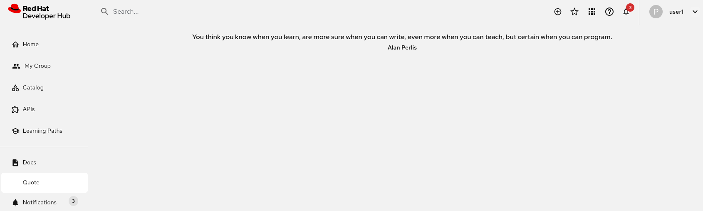

# Dev Quote Dynamic Plugin for Red Hat Developer Hub

This is an example of a dynamic public to use with Red Hat Developer Hub.
It is basically a wrapper of the original [Dev Quotes plugin](https://github.com/Parsifal-M/backstage-dev-quotes)

## Generate Dynamic Plugin as NPM

### Configuration

The main files to describe this plugin are:

* `package.json` - Describe the module, dependencies, and scripts
* `tsconfig.json` - Compiler and distribution options
* `app-config.yaml` - Application configuration for publishing

### Building and Publishing

Install dependencies: `yarn install`

Compile the package: `yarn tsc`

Build the package: `yarn build`

Export plugin: `yarn run export-dynamic`

Publish plugin: `yarn publish`

### Deploying into Red Hat Developer Hub

Add the configuration into the `global` section describing the package of this
plugin and its configuration. It is needed to add the integrity for the version
deployed into Red Hat Developer Hub.

The integrity value is described with the command:

`npm info @rmarting/rhdh-dynamic-devquote-plugin@0.0.4`

An example of that configuration can be:

```yaml
global:
  dynamic:
    includes:
      - dynamic-plugins.default.yaml
    plugins:
      - package: '@rmarting/rhdh-dynamic-devquote-plugin@0.0.4'
        integrity: sha512-FxJ6m08GvO3f2qW8MOb+GTXQJyExA1aVAK8pzXTjAIyuENoVNbg3ajzuBTysJXLykNQwA+d9TIrbQUc/kdcpAA==
        pluginConfig:
          dynamicPlugins:
            frontend:
              rmarting.rhdh-dynamic-devquote-plugin:
                mountPoints:
                  - mountPoint: entity.page.overview/cards
                    importName: DevQuote
                    config:
                      layout:
                        gridColumnEnd:
                          lg: span 4
                          md: span 6
                          xs: span 12
                dynamicRoutes:
                  - importName: DevQuote
                    menuItem:
                      text: Quote
                    path: /devquote
```

### References

* [Janus-IDP - Dynamic Plugins Support](https://github.com/janus-idp/backstage-showcase/blob/main/showcase-docs/dynamic-plugins.md)
* [Janus-IDP - Helm Chart](https://artifacthub.io/packages/helm/janus-idp/backstage)

## Generate Dynamic Plugin as OCI

This mechanism uses the [RHDH Dynamic Plugin Factory](https://github.com/redhat-developer/rhdh-dynamic-plugin-factory).

1. Set up your user variables to publish the OCI artifact into your Container Image Registry in the `config/.env` file:

```text
# Registry configuration
REGISTRY_URL=quay.io # E.g
REGISTRY_INSECURE=false

REGISTRY_USERNAME=your_username
REGISTRY_PASSWORD=your_password

REGISTRY_NAMESPACE=your_namespace

# Logging
LOG_LEVEL=DEBUG
```

2. Pull image version of the dynamic plugin factory:

```shell
podman pull quay.io/rhdh-community/dynamic-plugins-factory:1.8
```

3. Build Image and push into the container registry:

```shell
podman run --rm -it \
  --device /dev/fuse \
  -v ./config:/config:z \
  -v ./workspace:/workspace:z \
  -v ./outputs:/outputs:z \
  quay.io/rhdh-community/dynamic-plugins-factory:1.8 \
  --workspace-path ./ \
  --push-images
```

4. Use it as dynamic plugin in your RHDH instance. E.g:

```yaml
      - package: oci://quay.io/rhdh-adventure-organization/parsifal-m-plugin-dev-quotes-homepage:3.0.8!parsifal-m-plugin-dev-quotes-homepage
        disabled: false
        pluginConfig:
          dynamicPlugins:
            frontend:
              parsifal-m.plugin-dev-quotes-homepage:
                mountPoints:
                  - mountPoint: entity.page.overview/cards
                    importName: DevQuote
                    config:
                      layout:
                        gridColumnEnd:
                          lg: span 4
                          md: span 6
                          xs: span 12
                dynamicRoutes:
                  - importName: DevQuote
                    menuItem:
                      text: Quote
                    path: /devquote
```

Your RHDH will look like as:



### References

* [RHDH Dynamic Plugin Factory](https://github.com/redhat-developer/rhdh-dynamic-plugin-factory)
